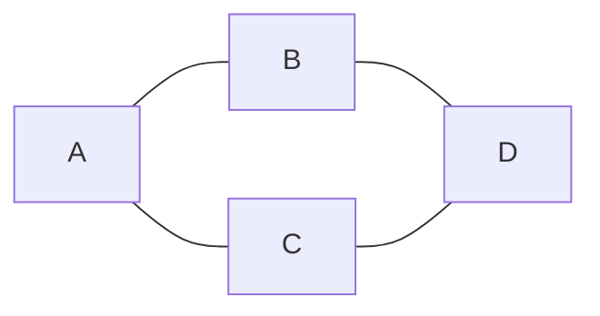
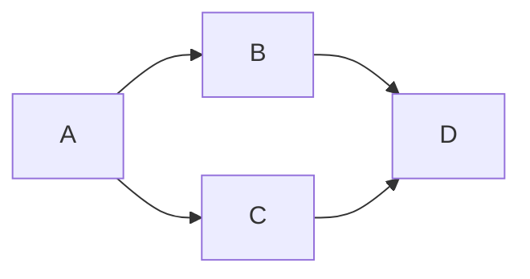
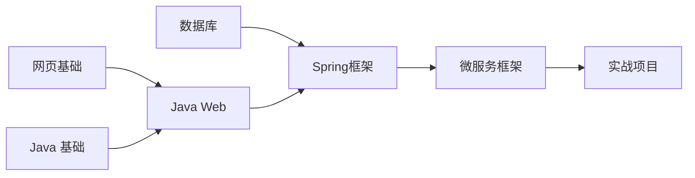

# 二叉树

## 遍历

遍历分为两种

1.广度优先遍历：尽可能先访问距离根最近的节点，称为层序遍历

2.深度优先遍历：对于二叉树，可以进一步分成三种(要深入到叶子节点)

​	1.前序遍历，对于每一颗子树，先访问该节点，然后是左子树，最后是右子树

​	2.中序遍历，对于每一棵子树，先访问左子树，然后是该节点，最后是右子树

​	3.后序遍历，对于每一棵子树，先访问左子树，然后是右子树，最后是该节点

无论哪种遍历方式，经过节点的路径都是一样的

## 层序遍历

```java
void bfs(TreeNode root) {
    Queue<TreeNode> queue = new ArrayDeque<>();
    queue.add(root);
    while (!queue.isEmpty()) {
        TreeNode node = queue.poll(); 
        if (node.left != null) {
            queue.add(node.left);
        }
        if (node.right != null) {
            queue.add(node.right);
        }
    }
}
```


### 前序遍历

**递归方式**

```java
static void preOrder(TreeNode node){
    if(node == null){
        return;
    }
    System.out.print(node.val + " ");
    preOrder(node.left);
    preOrder(node.right);
}
```

**非递归**（中序遍历仅是输出位置变化）

```java
LinkedList<TreeNode> stack = new LinkedList<>();
TreeNode curr = root;
while(curr != null || !stack.isEmpty){
    if(curr != null){
        System.out.println("去:" + curr.val);  // 先序遍历
        stack.push(curr); // 入栈，记住回去的路
        curr = curr.left;
    }else{
        TreeNode pop = stack.pop();
        System.out.println("回:" + pop.val); // 中序遍历
		// 切换到右子树
        curr = pop.right;
    }
}

```

### 中序遍历

**递归方式**

```java
static void inOrder(TreeNode node){
    if(node == null){
        return;
    }
    inOrder(node.left);
    System.out.print(node.val + " ");
    inOrder(node.right);
}
```

### 后序遍历

**递归方式**

```java
void postOrder(TreeNode node){
    if(node == null){
        return;
    }
    postOrder(node.left);
    postOrder(node.right);
    System.out.print(node.val + " ");
}
```

**非递归方式**

```java
LinkedList<TreeNode> stack = new LinkedList<>();
TreeNode curr = root;
TreeNode pop = null; // 记录最新弹出栈的元素
while(curr != null || !stack.isEmpty){
    if(curr != null){
        System.out.println("去:" + curr.val);
        stack.push(curr); // 入栈，记住回去的路
        curr = curr.left;
    }else{
        TreeNode peek = stack.peek(); // 获取栈顶元素
        if(peek.right == null || peek.right == pop){
        	pop = stack.pop();
        	System.out.println("回:" + pop.val);    
        }else{
            // 切换到右子树
        	curr = peek.right;
        }
    }
}

```

### 非递归统一模板


# 图

图是由顶点和边组成的数据结构，以下是关于图的一些概念

- 有向&无向：有向图边是单向的，无向图边是双向的
- 度：指与该顶点相邻的边的数量，有向图中细分为出度和入度
- 权：边可以有权重，代表从源顶点到目标顶点的距离、费用、时间或其他度量。

- 路径：路径被定义为从一个顶点到另一个顶点的一系列连续边，长度如果不考虑权重就是边的数量，考虑权重就是边的权重累加
- 环：在有向图中，从一个顶点开始，可以通过若干条有向边返回到该顶点，那么就形成了一个环
- 连通性：如果两个顶点之间存在路径，则这两个顶点是连通的，所有顶点都连通，则该图被称之为连通图，若子图连通，则称为连通分量

## 图的表示

比如说，下面的图



用**邻接矩阵**可以表示为：

```
  A B C D
A 0 1 1 0
B 1 0 0 1 
C 1 0 0 1
D 0 1 1 0
```

用**邻接表**可以表示为：

```
A -> B -> C
B -> A -> D
C -> A -> D
D -> B -> C
```

有向图的例子



```
  A B C D
A 0 1 1 0
B 0 0 0 1
C 0 0 0 1
D 0 0 0 0
```

```
A - B - C
B - D
C - D
D - empty
```

## Java表示

顶点

```java
public class Vertex {
    String name;
    List<Edge> edges;
    
    // 拓扑排序相关
    int inDegree;
    int status; // 状态 0-未访问 1-访问中 2-访问过，用在拓扑排序

    // dfs, bfs 相关
    boolean visited;

    // 求解最短距离相关
    private static final int INF = Integer.MAX_VALUE;
    int dist = INF;
    Vertex prev = null;
}
```

边

```java
public class Edge {

    Vertex linked;
    int weight;

    public Edge(Vertex linked) {
        this(linked, 1);
    }

    public Edge(Vertex linked, int weight) {
        this.linked = linked;
        this.weight = weight;
    }
}
```

## DFS

```java
public class Dfs {
    public static void main(String[] args) {
        Vertex v1 = new Vertex("v1");
        Vertex v2 = new Vertex("v2");
        Vertex v3 = new Vertex("v3");
        Vertex v4 = new Vertex("v4");
        Vertex v5 = new Vertex("v5");
        Vertex v6 = new Vertex("v6");

        v1.edges = List.of(new Edge(v3), new Edge(v2), new Edge(v6));
        v2.edges = List.of(new Edge(v4));
        v3.edges = List.of(new Edge(v4), new Edge(v6));
        v4.edges = List.of(new Edge(v5));
        v5.edges = List.of();
        v6.edges = List.of(new Edge(v5));

        dfs1(v1);
    }

    private static void dfs2(Vertex v) {
        LinkedList<Vertex> stack = new LinkedList<>();
        stack.push(v);
        while (!stack.isEmpty()) {
            Vertex pop = stack.pop();
            pop.visited = true;
            System.out.println(pop.name);
            for (Edge edge : pop.edges) {
                if (!edge.linked.visited) {
                    stack.push(edge.linked);
                }
            }
        }
    }

    private static void dfs1(Vertex v) {
        v.visited = true;
        System.out.println(v.name);
        for (Edge edge : v.edges) {
            if (!edge.linked.visited) {
                dfs(edge.linked);
            }
        }
    }
}
```

### BFS

```java
public class Bfs {
    public static void main(String[] args) {
        Vertex v1 = new Vertex("v1");
        Vertex v2 = new Vertex("v2");
        Vertex v3 = new Vertex("v3");
        Vertex v4 = new Vertex("v4");
        Vertex v5 = new Vertex("v5");
        Vertex v6 = new Vertex("v6");

        v1.edges = List.of(new Edge(v3), new Edge(v2), new Edge(v6));
        v2.edges = List.of(new Edge(v4));
        v3.edges = List.of(new Edge(v4), new Edge(v6));
        v4.edges = List.of(new Edge(v5));
        v5.edges = List.of();
        v6.edges = List.of(new Edge(v5));

        bfs(v1);
    }

    private static void bfs(Vertex v) {
        LinkedList<Vertex> queue = new LinkedList<>();
        v.visited = true;
        queue.offer(v);
        while (!queue.isEmpty()) {
            Vertex poll = queue.poll();
            System.out.println(poll.name);
            for (Edge edge : poll.edges) {
                if (!edge.linked.visited) {
                    edge.linked.visited = true;
                    queue.offer(edge.linked);
                }
            }
        }
    }
}
```

### 拓扑排序



#### Kahn

```java
public class TopologicalSort {
    public static void main(String[] args) {
        Vertex v1 = new Vertex("网页基础");
        Vertex v2 = new Vertex("Java基础");
        Vertex v3 = new Vertex("JavaWeb");
        Vertex v4 = new Vertex("Spring框架");
        Vertex v5 = new Vertex("微服务框架");
        Vertex v6 = new Vertex("数据库");
        Vertex v7 = new Vertex("实战项目");

        v1.edges = List.of(new Edge(v3)); // +1
        v2.edges = List.of(new Edge(v3)); // +1
        v3.edges = List.of(new Edge(v4));
        v6.edges = List.of(new Edge(v4));
        v4.edges = List.of(new Edge(v5));
        v5.edges = List.of(new Edge(v7));
        v7.edges = List.of();

        List<Vertex> graph = List.of(v1, v2, v3, v4, v5, v6, v7);
        // 1. 统计每个顶点的入度
        for (Vertex v : graph) {
            for (Edge edge : v.edges) {
                edge.linked.inDegree++;
            }
        }
        /*for (Vertex vertex : graph) {
            System.out.println(vertex.name + " " + vertex.inDegree);
        }*/
        // 2. 将入度为0的顶点加入队列
        LinkedList<Vertex> queue = new LinkedList<>();
        for (Vertex v : graph) {
            if (v.inDegree == 0) {
                queue.offer(v);
            }
        }
        // 3. 队列中不断移除顶点，每移除一个顶点，把它相邻顶点入度减1，若减到0则入队
        List<String> result = new ArrayList<>();
        while (!queue.isEmpty()) {
            Vertex poll = queue.poll();
//            System.out.println(poll.name);
            result.add(poll.name);
            for (Edge edge : poll.edges) {
                edge.linked.inDegree--;
                if (edge.linked.inDegree == 0) {
                    queue.offer(edge.linked);
                }
            }
        }
        if (result.size() != graph.size()) {
            System.out.println("出现环");
        } else {
            for (String key : result) {
                System.out.println(key);
            }
        }
    }
}
```


#### DFS

```java
public class TopologicalSortDFS {

    public static void main(String[] args) {
        Vertex v1 = new Vertex("网页基础");
        Vertex v2 = new Vertex("Java基础");
        Vertex v3 = new Vertex("JavaWeb");
        Vertex v4 = new Vertex("Spring框架");
        Vertex v5 = new Vertex("微服务框架");
        Vertex v6 = new Vertex("数据库");
        Vertex v7 = new Vertex("实战项目");

        v1.edges = List.of(new Edge(v3));
        v2.edges = List.of(new Edge(v3));
        v3.edges = List.of(new Edge(v4));
        v6.edges = List.of(new Edge(v4));
        v4.edges = List.of(new Edge(v5));
        v5.edges = List.of(new Edge(v7));
        v7.edges = List.of();

        List<Vertex> graph = List.of(v1, v2, v3, v4, v5, v6, v7);
        LinkedList<String> result = new LinkedList<>();
        for (Vertex v : graph) {
            if(v.status==0) {
                dfs(v, result);
            }
        }
        System.out.println(result);
    }

    private static void dfs(Vertex v, LinkedList<String> result) {
        if (v.status == 2) {
            return;
        }
        if (v.status == 1) {
            throw new RuntimeException("发现环");
        }
        v.status = 1;
        for (Edge edge : v.edges) {
            dfs(edge.linked, result);
        }
        v.status = 2;
        result.push(v.name);
    }
}
```

## 最短路径


## 最小生成树


## 不相交集合


### 图-相关题目

| 题目编号 | 题目标题               | 算法思想         |
| -------- | ---------------------- | ---------------- |
| 547      | 省份数量               | DFS、BFS、并查集 |
| 797      | 所有可能路径           | DFS、BFS         |
| 1584     | 连接所有点的最小费用   | 最小生成树       |
| 743      | 网络延迟时间           | 单源最短路径     |
| 787      | K 站中转内最便宜的航班 | 单源最短路径     |
| 207      | 课程表                 | 拓扑排序         |
| 210      | 课程表 II              | 拓扑排序         |

